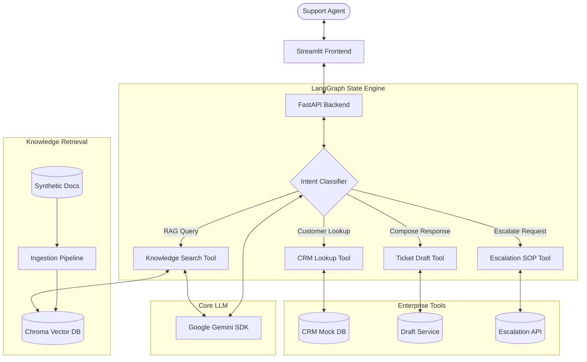
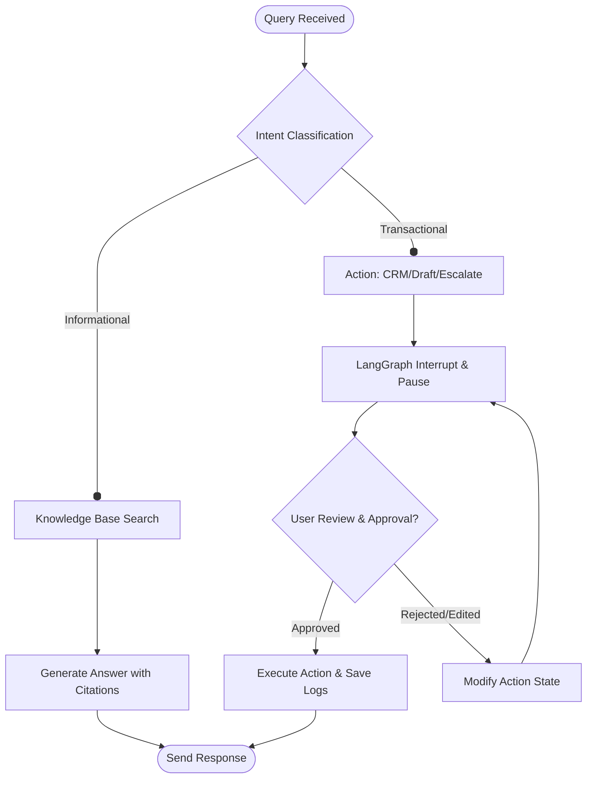

# Solution Design Document: IntelliDesk AI

## 1. System Architecture
IntelliDesk consists of a multi-tier enterprise architecture separating the UI (Streamlit), Orchestration & API Layer (FastAPI + LangGraph), and Retrieval Engine (ChromaDB + Sentence-Transformers).

## 2. Agent Decision & Human-in-the-Loop Flow
For sensitive actions (such as composing a formal customer response or executing a CRM update/escalation), the agent execution is paused using LangGraph's native interrupt workflow. The user reviews the draft, makes any changes, and approves the action before execution resumes.

## 3. Technology Component Matrix
| Component | Technology Stack | Purpose |
|---|---|---|
| **Frontend** | Streamlit | Responsive, agent-facing dashboard with state history and approval panels. |
| **Backend API** | FastAPI | Hosts LangGraph endpoints, mock CRM services, and evaluation pipelines. |
| **LLM Provider** | Google GenAI SDK (`gemini-2.5-flash`) | Core language model for reasoning, extraction, and generation. |
| **Orchestrator** | LangGraph | Manages agent states, transitions, conditional routers, and interrupts. |
| **Vector DB** | ChromaDB (Local SQLite-based) | Vector database for storing and querying document chunk embeddings. |
| **Embeddings** | `sentence-transformers/all-MiniLM-L6-v2` | High-efficiency local sentence embeddings. |

## 4. Key Design Decisions
1. **Google GenAI SDK**: Utilizing the official SDK (`google-genai`) allows native integration with Gemini models.
2. **Deterministic Routing**: Intent classification utilizes Pydantic-based structured outputs to ensure reliability.
3. **Local Embedding Models**: Sentence-Transformers runs locally, avoiding network latency and per-token API costs during vector ingestion.
